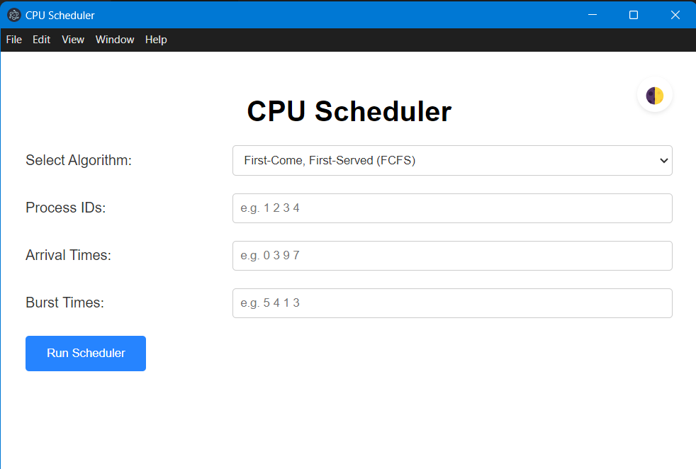
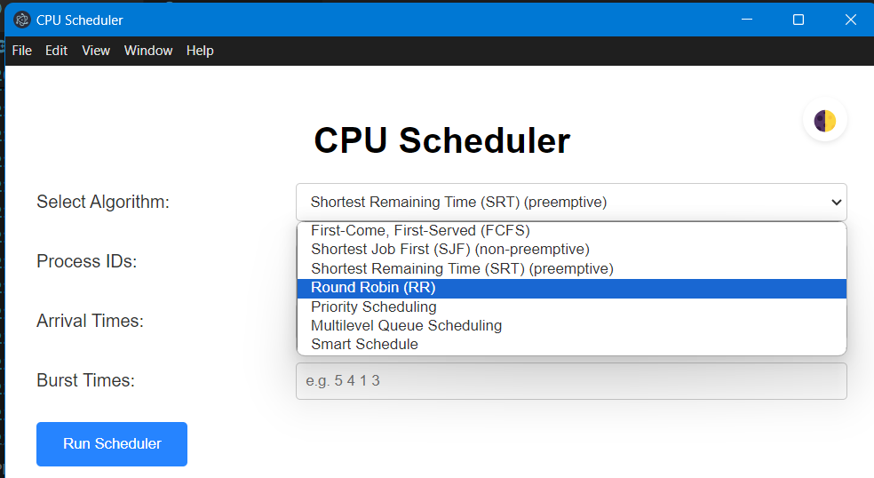
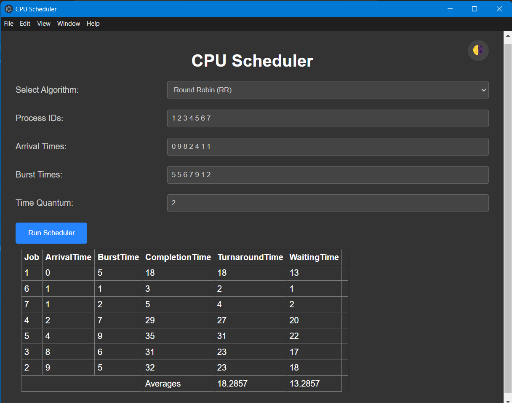
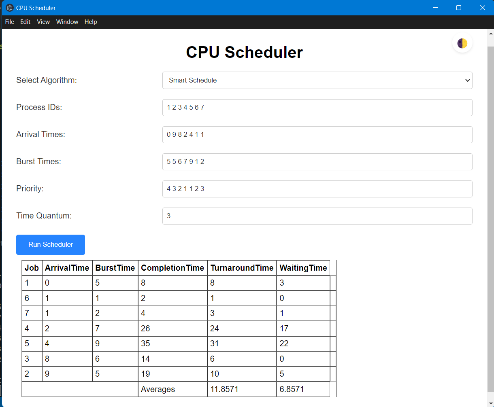

# CPU Scheduler

* Author: Akshay Kumar

## Project Description
Operating systems play a crucial role in managing computer resources efficiently, with process scheduling being a fundamental component. A CPU scheduler is responsible for managing the execution of processes. It decides which process should utilize the CPU and for how long, ensuring efficient resource utilization.

This project implements 7 CPU scheduling algorithms as follows:
* First-Come, First-Served (FCFS)
* Shortest Job First (SJF) [Non-preemptive]
* Shortest Remaining Time First (SRTF) [Preemptive]
* Round Robin (RR)
* Priority Scheduling
* Multilevel Queue Scheduling 
* Smart Scheduling

Smart Scheduling chooses the most suitable algorithm depending upon the input parameters to ensure efficient task scheduling along with  minimizing the Average Waiting Time of processes and maximizing CPU usage.

The auto_schedule function dynamically selects the most suitable scheduling algorithm based on input process characteristics to ensure efficient task scheduling.
## Installation

* Git Clone this Repository
```bash
    git clone https://github.com/akshay27ak/CPU-Scheduler.com
```
* Enter into the main directory
  ```bash
  cd CPU-Scheduler
  ````
* Compile the scheduler.cpp file using a compiler with C++ 11 or higher
```bash
    g++ -o scheduler.exe scheduler.cpp
```
* run npm install to install all dependencies
```bash
  npm install my-project
```
* run npm start to run the project
```bash
    npm start
```
## Technologies Used
The CPU Scheduler application leverages modern technologies to deliver a seamless user experience and robust backend processing:

* Electron: A framework for building cross-platform desktop applications using web technologies (HTML, CSS, JavaScript). Electron enables the creation of a responsive and interactive user interface.

* C++: Chosen for its efficiency and low-level system access, C++ forms the backbone of the application's backend, implementing process scheduling algorithms and performance metrics calculations.

* IPC (Inter-Process Communication): Facilitates seamless communication between the Electron frontend and C++ backend, enabling real-time data exchange and synchronization for interactive visualization.
## Interaction Flow
The interaction flow between the frontend and backend of the CPU Scheduler application is as follows:

1. The user selects a scheduling algorithm and enters process details (process ID, arrival time, burst time, priority) through the Electron frontend.


2. Upon clicking the "Run Scheduler" button, the frontend sends an IPC message containing the selected algorithm and process details to the backend.

3. The backend receives the IPC message, processes the scheduling request using the specified algorithm, and computes the necessary performance metrics.

4. After completing the scheduling process, the backend sends a response back to the Electron frontend, where the output is formatted to a table.

5. The Electron frontend receives the scheduling results, updates the UI to display the process details, and shows performance metrics such as Completion time, Turnaround time, and Waiting Time for each process with average turnaround time and average waiting time.
## How to use the application
* The first look of the application will be like this :


*Figure 1: Application's initial look*

* User can toggle between Light and Dark Modes using Toggle Button.

* User can select one of the 6 pre-defined CPU Scheduling algorithms I have implemented.


*Figure 2: The Algorithm Selection*

* Now the user is free to input any number of processes. The user is expected to fill in input parameters depending on the algorithm selected as follows:

    1. Process IDs: separated by spaces, e.g. 1 2 3 4 5 
    2. Burst Times: Burst times of corresponding process, each of them separated by space. It cannot be equal to zero.
    3. Arrival Times: Arrival Times of corresponding processes, each of them separated by space.
    4. Priority: Priority Value of corresponding processes, each of them separated by space.
    5. Time Quantum: It should be a single positive integer.

> [!NOTE]
> There should be a valid arrival time, burst time, and priority value for each process ID.

* After entering each input field correctly, click on the Run Scheduler Button. An Output table will be displayed showing Arrival Time, Burst Time, Completion Time, Turnaround Time, and Waiting Time corresponding to each process.
* The Average Turnaround Time and Average Waiting Time will be displayed at the bottom of their respective columns.





*Figure 3: Round-Robin Example consisting of 7 processes*


## Smart Scheduling

* When the User selects the *Smart Scheduling* option, then the process parameters are analyzed in the backend. Depending upon the variations in priority values and arrival times, the scheduler automatically selects the best scheduling algorithm for the input processes.

* Here is an example to illustrate the difference between Smart Scheduling vs Round-Robin Scheduling on the same set of processes. 
* There is a _considerable drop_ in Average Waiting Time and Average Turnaround Time when switched to Smart Scheduling.


*Figure 4: Example of Smart Scheduling*

## Implementation and Working of Each Algorithm

### First Come First Serve (FCFS)

#### Implementation:
```bash 
void firstComeFirstServe(vector<Process>& processes){
    sort(processes.begin(),processes.end(),sortByArrivalTime);
    int n = processes.size();
    int time = processes[0].arrivalTime;
    for (auto& p : processes){
        time = max(time , p.arrivalTime);

        p.completionTime = time + p.burstTime;
        p.turnAroundTime = p.completionTime - p.arrivalTime;
        p.waitingTime = p.turnAroundTime - p.burstTime;

        time += p.burstTime;
    }
}
````
#### Explanation:

* The processes are sorted based on their arrival times.
* The CPU processes each job in the order they arrive, without preemption.
* The start time for each process is set to the maximum of the current time and the process's arrival time.
* Each process runs to completion before the next process starts.
* Completion time, turnaround time, and waiting time for each process are calculated.

### Shortest Job First (SJF)
#### Implementation:
```bash
void shortestJobFirst(vector<Process>& processes){
    sort(processes.begin(),processes.end(),sortByArrivalTime);

    priority_queue<pair<int, int>, vector<pair<int, int>>, greater<pair<int, int>>> pq; // pair of burst time and index
    int j = 0;
    int time = processes[0].arrivalTime;
    int completed = 0;
    int n = processes.size();
    while(completed != n){
        while(j<n && processes[j].arrivalTime <= time){
            pq.push(make_pair(processes[j].burstTime, j));
            j++;
        }
        if (!pq.empty()){
            int index = pq.top().second;
            int arrivalTime = processes[index].arrivalTime;
            int burstTime = processes[index].burstTime;
            pq.pop();

            processes[index].completionTime = (time + burstTime);
            processes[index].turnAroundTime = (processes[index].completionTime - arrivalTime);
            processes[index].waitingTime = (processes[index].turnAroundTime - burstTime);
            time += burstTime;
            completed ++;
        }
        else{
            if (j < n) {
                time = processes[j].arrivalTime;
            }
            else break;
        }
    }
}

```

#### Explanation:
* Processes are sorted based on their arrival times.
* A priority queue is used to select the process with the shortest burst time that has arrived by the current time.
* The selected process runs to completion.
* The algorithm updates the current time, completion time, turnaround time, and waiting time for each process.
* This continues until all processes are completed.

### Shortest Remaining Time First (SRTF)

#### Implementation:
```bash
void shortestRemaining_CPU_BurstTime(vector<Process>& processes){
    sort(processes.begin(),processes.end(),sortByArrivalTime);
    priority_queue<pair<int, int>, vector<pair<int, int>>, greater<pair<int, int>>> pq;
    int j = 0;
    int time = processes[0].arrivalTime;
    int completed = 0;
    int n = processes.size();
    int last_instant = 2e6;
    for (int time = 0; time < last_instant; time++){
        
        while(j<n && processes[j].arrivalTime == time){
            pq.push(make_pair(processes[j].burstTime, j));
            j++;
        }
        if (!pq.empty()){
            int index = pq.top().second;
            int remainingTime = pq.top().first;
            pq.pop();

            int arrivalTime = processes[index].arrivalTime;
            int burstTime   = processes[index].burstTime;

            if (remainingTime == 1){ // process finished
                processes[index].completionTime = time + 1;
                processes[index].turnAroundTime = (processes[index].completionTime - arrivalTime);
                processes[index].waitingTime = (processes[index].turnAroundTime - burstTime);
                completed ++;
            }
            else{
                pq.push(make_pair(remainingTime - 1, index));
            }
        }
        if(completed == n)break;
    }
}
```
#### Explanation :
* Processes are sorted by arrival time.
* A priority queue is used to manage processes based on their remaining burst time.
* At each time unit, the process with the shortest remaining burst time is selected to run.
* The remaining burst time of the running process is decremented by one.
* When a process completes, its completion time, turnaround time, and waiting time are calculated.
* The algorithm continues until all processes are completed.

### Round Robin (RR)

#### Implementation:
```bash
void roundRobin(vector<Process>& processes , int originalQuantum){
    sort(processes.begin(),processes.end(),sortByArrivalTime);
    queue<pair<int,int>>q;  //[index , remaining burst time]
    int j=0;
    int time = 0;
    int completed = 0;
    int n = processes.size();
    int runningQuantum = originalQuantum;
    if(processes[j].arrivalTime == 0){
        q.push(make_pair(j,processes[j].burstTime));
        j++;
    }
    int last_instant = 2e6;
    for(int time = 0;time < last_instant;time++){
        if(!q.empty()){
            int index = q.front().first;
            q.front().second = q.front().second-1;
            int remainingBurstTime = q.front().second;
            int arrivalTime = processes[index].arrivalTime;
            int burstTime = processes[index].burstTime;
            runningQuantum--;
            while(j<n && processes[j].arrivalTime == time+1){
                q.push(make_pair(j,processes[j].burstTime));
                j++;
            }

            if(remainingBurstTime==0){
                processes[index].completionTime = time+1;
                processes[index].turnAroundTime = (processes[index].completionTime - arrivalTime);
                processes[index].waitingTime = (processes[index].turnAroundTime - burstTime);
                runningQuantum = originalQuantum;
                q.pop();
            }
            else if(runningQuantum==0){
                q.pop();
                q.push(make_pair(index,remainingBurstTime));
                runningQuantum = originalQuantum;
            }
        }
        while(j<n && processes[j].arrivalTime==time+1){
            q.push(make_pair(j,processes[j].burstTime));
            j++;
        }
    }
}
```
#### Explanation:

* Processes are sorted by arrival time.
* A queue is used to manage the processes in the order they arrive.
* Each process gets a fixed time quantum to run.
* If a process does not finish within its time quantum, it is placed back at the end of the queue with its remaining burst time.
* If a process finishes within its time quantum, its completion time, turnaround time, and waiting time are calculated.
* The algorithm continues in a cyclic manner until all processes are completed.

### Priority Scheduling

#### Implementation:
```bash
void PriorityScheduling(vector<Process>& processes) {
    sort(processes.begin(), processes.end(), sortByArrivalTime);
    int currentTime = processes[0].arrivalTime;
    int n = processes.size();
    priority_queue<pair<int, int>, vector<pair<int, int>>, greater<pair<int, int>>> pq; //[priority , index]
    int completed = 0;
    int j = 0;

    while (completed < n) {
        while (j < n && !processes[j].completionStatus && processes[j].arrivalTime <= currentTime) {
            pq.push(make_pair(processes[j].priority, j));
            j++;
        }

        if (!pq.empty()) {
            int idx = pq.top().second;
            pq.pop();

            int arrivalTime = processes[idx].arrivalTime;
            int burstTime = processes[idx].burstTime;

            processes[idx].completionTime = currentTime + burstTime;
            processes[idx].turnAroundTime = processes[idx].completionTime - arrivalTime;
            processes[idx].waitingTime = processes[idx].turnAroundTime - burstTime;

            currentTime += burstTime;
            completed++;
        } else {
            if (j < n) {
                currentTime = processes[j].arrivalTime;
            }
        }
    }
}
```

#### Explanation:
* Processes are sorted by arrival time.
* A priority queue is used to manage processes based on their priority.
* At each step, the process with the highest priority (lowest priority value) is selected to run.
* The selected process runs to completion.
* The current time is updated, and the completion time, turnaround time, and waiting time for each process are calculated.
* This continues until all processes are completed.


### Multi-Level Queue Scheduling (MLQ)

#### Implementation:
```bash
void addToMLQ(vector<Process>& processes , MultiLevelQueue &mlq , int currentTime , int Priority_Threshold){
    int n = processes.size();
    for(int i=0;i<n;i++) {
        if(currentTime == processes[i].arrivalTime){
            if(processes[i].priority <= Priority_Threshold) {
                mlq.foregroundQueue.push(i);
            } 
            else{
                mlq.backgroundQueue.push_back(i);
            }
        }
    }
}
void MultiLevelQueueScheduling(vector<Process>& processes , int TimeQuantum) {
    sort(processes.begin(),processes.end(),sortByArrivalTime);
    int n = processes.size();
    for(int i=0;i < n;i++) {
        processes[i].remainingBurstTime = processes[i].burstTime;
    }
    int Priority_Threshold = 10;
    int currentTime = 0;
    int completed = 0;
    vector<bool> visited(n, false);
    MultiLevelQueue mlq;
    while(completed < n) {
        addToMLQ(processes,mlq,currentTime,Priority_Threshold);

        if(mlq.foregroundQueue.empty() && mlq.backgroundQueue.empty()) {
            currentTime++;
            continue;
        }
        else if(mlq.foregroundQueue.size() > 0) {
            int idx = mlq.foregroundQueue.front();
            mlq.foregroundQueue.pop();

            if(!visited[idx]) {
                processes[idx].startTime = currentTime;
                visited [idx] = true;
            }
            if(processes[idx].remainingBurstTime > TimeQuantum) {
                processes[idx].remainingBurstTime -= TimeQuantum;
                int tempTime = currentTime + TimeQuantum;

                // edge case if new background processes are introduced during quantum time
                for(int k=currentTime+1; k < tempTime;k++) {
                    addToMLQ(processes,mlq,k,Priority_Threshold);
                }

                currentTime = tempTime;
                mlq.foregroundQueue.push(idx);
            } 
            else {
                int remainingTime = processes[idx].remainingBurstTime;
                processes[idx].remainingBurstTime = 0;
                int tempTime = currentTime + remainingTime;

                // edge case if new background processes are introduced during quantum time
                for(int k=currentTime + 1; k < tempTime;k++) {
                    addToMLQ(processes,mlq,k,Priority_Threshold);
                }

                currentTime = tempTime;
                processes[idx].completionTime = currentTime;
                processes[idx].turnAroundTime = processes[idx].completionTime - processes[idx].arrivalTime;
                processes[idx].waitingTime = processes[idx].turnAroundTime - processes[idx].burstTime;
                completed++;
            }
        }
        else if(mlq.backgroundQueue.size() > 0) {
            int idx = mlq.backgroundQueue.front();
            mlq.backgroundQueue.pop_front();

            if(!visited[idx]) {
                processes[idx].startTime = currentTime;
                visited[idx] = true;
            }

            processes[idx].remainingBurstTime--;
            currentTime++;

            if(processes[idx].remainingBurstTime > 0) {
                mlq.backgroundQueue.push_front(idx);
            } 
            else {
                processes[idx].completionTime = currentTime;
                processes[idx].turnAroundTime = processes[idx].completionTime - processes[idx].arrivalTime;
                processes[idx].waitingTime = processes[idx].turnAroundTime - processes[idx].burstTime;
                completed++;
            }
        }
    }
}
````

#### Explanation:
* Processes are sorted by arrival time.
* Processes are divided into foreground and background queues based on their priority.
* Foreground queue uses Round Robin scheduling with a time quantum.
* Background queue uses First Come First Serve scheduling.
* The algorithm runs processes from the foreground queue first. If it is empty, processes from the background queue are executed.
* The current time is updated, and the completion time, turnaround time, and waiting time for each process are calculated.
* The algorithm continues until all processes are completed.


### Smart Scheduling

#### Implementation:
```bash
void auto_schedule(std::vector<Process> & processes){
    int n = processes.size();
    int mx_priority = 0 , mn_priority = 1e7;
    int mx_arrival = 0 , mn_arrival = 1e7;
    int THRESHOLD = 10;
    int LOAD = 5;
    for(auto &p: processes){
        mx_priority = max(mx_priority,p.priority);
        mn_priority = min(mn_priority,p.priority);
        mx_arrival = max(mx_arrival,p.priority);
        mn_arrival = min(mn_arrival,p.priority);
    }
    if(mx_priority-mn_priority >= THRESHOLD){
        MultiLevelQueueScheduling(processes,originalQuantum);
    }
    else if(mx_arrival-mn_arrival <= 8){
        shortestRemaining_CPU_BurstTime(processes);
    }
    else if(mx_arrival-mn_arrival > THRESHOLD+LOAD){
        roundRobin(processes,originalQuantum);
    }
    else{
        // if all other conditions are false the easiest algorithm to implement will be FCFS    
        firstComeFirstServe(processes);
    }
}
```
#### Explanation:
* The auto_schedule function dynamically selects the most suitable scheduling algorithm based on input process characteristics to ensure efficient task scheduling.
* The scheduling algorithm is chosen based on the characteristics of the processes:
    * If the range of priorities is large,      Multi-Level Queue Scheduling is used.
    * If the range of arrival times is small, Shortest Remaining Time First is used.
    * If the range of arrival times is very large, Round Robin is used.
    * If none of these conditions are met, First Come First Serve is used.
* The chosen scheduling algorithm is then applied to the processes to compute the performance metrics.
## Integration via IPC
In the CPU Scheduler application, the frontend (Electron) and backend (C++) communicate using IPC mechanisms provided by Electron's ipcRenderer and ipcMain modules. IPC allows asynchronous communication between the Electron main process and the C++ backend process, facilitating data exchange and coordination of scheduling tasks.

### Electron Frontend
The Electron frontend serves as the user interface layer, implemented using HTML, CSS, and JavaScript. It utilizes the Electron framework to create a windowed
## My Learning Takeaways from the Project

* ####  Understanding and Implementing Scheduling Algorithms
    The project was a fascinating dive into operating system fundamentals and enhanced my understanding of various CPU scheduling algorithms. Implementing these in C++ showcased their practical application and efficiency in process management. Working with advanced C++ features and debugging scheduling algorithms sharpened my coding and problem-solving skills. It reinforced the importance of selecting the right data structures and methods for specific tasks.

* #### Effective Integration and Communication
    It was a challenge to use Electron JS, a new framework for me, to build the project.Using IPC in Electron for data flow underscored the importance of modular design and clear communication within applications.Despite the learning curve, it was rewarding to apply core computer science concepts in this new environment.

* Overall, this project taught me a lot about OS concepts, software development, and practical problem-solving. It was a valuable experience that deepened my understanding of computer systems and enhanced my skills in software engineering.

## The resources/references used while working on the project
* Scheduling algorithms by [Neso Academy](https://youtube.com/playlist?list=PLBlnK6fEyqRitWSE_AyyySWfhRgyA-rHk&si=Kn5pgYnNhNxBF0DG)
* [Electron Documentation](https://www.electronjs.org/blog/electron-doumentation)
* For Implementations : [GeeksforGeeks](https://www.geeksforgeeks.org/program-for-fcfs-cpu-scheduling-set-1/)

